# MouScroll

- PC画面の特定箇所で、
- マウスの真ん中にある[ホイール](https://www.google.com/search?q=%E3%83%9E%E3%82%A6%E3%82%B9%E3%80%80%E3%83%9B%E3%82%A4%E3%83%BC%E3%83%AB&sxsrf=ALiCzsZzaWhTD86-usTjNdb3LbD2ehagCA:1670849933437&source=lnms&tbm=isch&sa=X&ved=2ahUKEwjKm4WGkfT7AhWmmVYBHTxmCZIQ_AUoAnoECAEQBA&biw=1873&bih=929&dpr=1)を
- スクロールすると

色々出来るアプリです.

ちなみにWindows専用です

<br>

## Requirement
Python3が入ってれば多分動きます.

`setup.py` では ↓ のモジュールをインストールしてます

- [pynput](https://pynput.readthedocs.io/en/latest/) : マウスとキーボードのイベント監視

<br>

- [pywin32](https://github.com/mhammond/pywin32) : クリップボード操作

<br>

- [pyautogui](https://pyautogui.readthedocs.io/en/latest/) : ホットキー用

<br>

- [pygetwindow](https://pygetwindow.readthedocs.io/en/latest/) : ActiveWindows取得とかに使う


<br>

## Install

ターミナルを開いて ↓ を実行.

<br>

```bash
# くろ～ん
> git clone git@github.com:physics11688/MouScroll.git

# ↑が出来ない人は ssh とかを調べるとして, ↓ で入る
> git clone https://github.com/physics11688/MouScroll.git

# 移動
> cd MouScroll

# １回使用するだけ
> python MouScroll.pyw

# セットアップして継続的に使う(自動起動する)なら
> python setup.py

```

<br>

## Uninstall
```bash
# Windows
> python uninstall.py

# UNIX系
$ python3 uninstall.py
```

<br>


## Usage

画面四隅でホイールをくりくりしてください.

意外と便利です.

<br>



<br>


<br>

## Auto Start Settings

`setup.py` では ↓ を実行してます.
XMLファイルのインポートです.

```powershell
> schtasks.exe /Create /TN StartMouScroll /XML StartMouScroll.xml 
```


<br>
